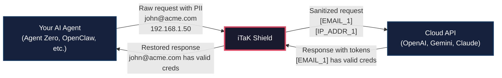
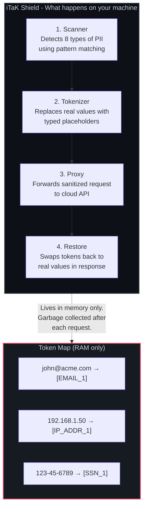
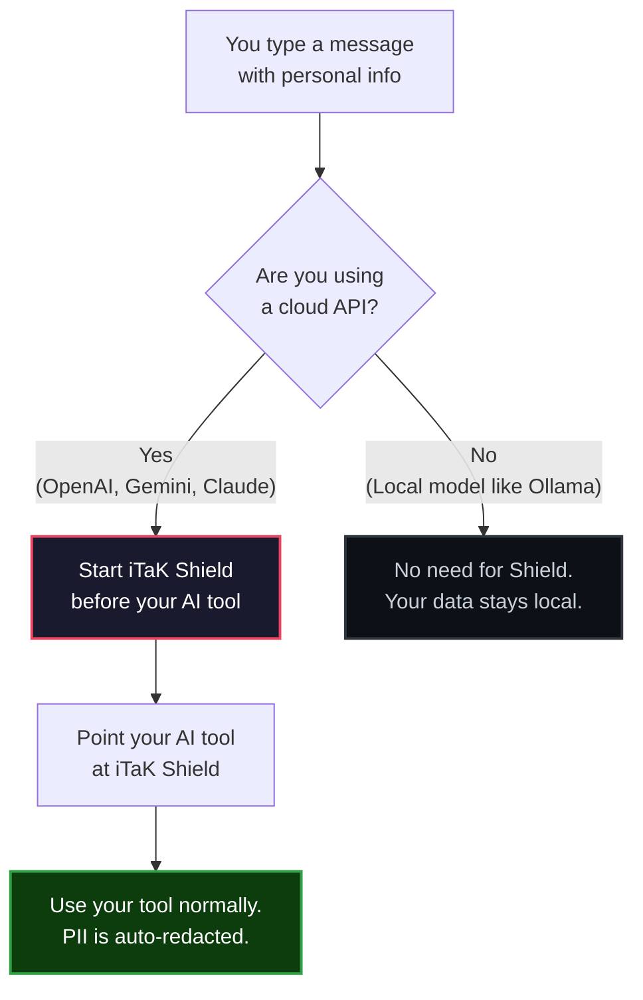
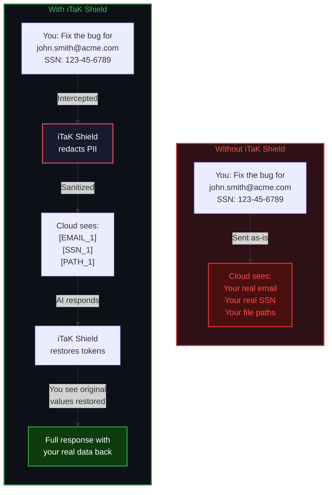

# iTaK Shield

**Privacy-first proxy for AI agents.** iTaK Shield sits between your AI tools and cloud APIs, automatically detecting and replacing sensitive data with safe placeholders before anything leaves your machine.

Your SSN, email, API keys, home directory paths, and private IPs never reach OpenAI, Anthropic, Google, or any other cloud provider. The AI still understands the context. Responses are restored to their original form before you see them.

---

## Table of Contents

- [How It Works](#how-it-works)
- [What Gets Detected](#what-gets-detected)
- [Getting Started](#getting-started)
  - [New to AI? Start Here](#new-to-ai-start-here)
  - [Installation](#installation)
  - [Your First Run](#your-first-run)
- [Usage Guide](#usage-guide)
  - [With Agent Zero](#with-agent-zero)
  - [With OpenClaw](#with-openclaw)
  - [With Open WebUI](#with-open-webui)
  - [With Python Scripts](#with-python-scripts)
  - [With curl](#with-curl)
- [CLI Reference](#cli-reference)
- [How It Protects You](#how-it-protects-you)
- [FAQ](#faq)
- [Credits & Inspiration](#credits--inspiration)
- [iTaK Ecosystem](#itak-ecosystem)
- [License](#license)

---

## How It Works



The AI sees `[EMAIL_1]` instead of your real email. It still knows the value is an email address, so it can reason about it correctly. It just never learns *which* email. When the response comes back mentioning `[EMAIL_1]`, iTaK Shield swaps it back to your real email before you see it.

### Under the Hood



---

## What Gets Detected

| Type | Examples | Replaced With |
|------|---------|---------------|
| Email addresses | `john@acme.com`, `ceo@company.org` | `[EMAIL_1]` |
| Social Security Numbers | `123-45-6789` | `[SSN_1]` |
| Phone numbers | `(555) 123-4567`, `+1-555-123-4567` | `[PHONE_1]` |
| API keys & tokens | `sk-abc123...`, `ghp_...`, `AIza...` | `[API_KEY_1]` |
| Credit card numbers | `4111-1111-1111-1111` | `[CREDIT_CARD_1]` |
| File paths with usernames | `C:\Users\John\Documents\...` | `[PATH_1]` |
| Private IP addresses | `192.168.1.100`, `10.0.0.5` | `[IP_ADDR_1]` |
| Passwords in config | `password=MySecret123` | `[PASSWORD_1]` |

**Key properties:**

- **Typed placeholders** - The AI retains full context (it knows `[EMAIL_1]` is an email, not random noise)
- **Consistent tokens** - The same value always maps to the same token within a request
- **Memory-only** - The token map is never written to disk and is garbage collected after each request
- **Zero config** - No rules to write. Detection is automatic

---

## Getting Started

### New to AI? Start Here

If you're new to AI tools, here's what you need to know:

**What are AI agents?** Programs like [Agent Zero](https://github.com/frdel/agent-zero), [OpenClaw](https://github.com/agentic-labs/openclaw), [Open WebUI](https://github.com/open-webui/open-webui), or [ChatGPT](https://chat.openai.com) that use large language models (LLMs) to help you with tasks. Many of these tools send your conversations to cloud servers run by companies like [OpenAI](https://openai.com), [Google](https://ai.google.dev), or [Anthropic](https://anthropic.com).

**Why does this matter now?** The AI agent movement is accelerating fast. [OpenClaw](https://github.com/agentic-labs/openclaw) helped spark a wave of open-source autonomous agents, and its creator was recently hired by OpenAI. [Agent Zero](https://github.com/frdel/agent-zero) brought fully autonomous coding and task execution to the open-source community. These tools are powerful, but when they're pointed at cloud APIs, your data goes with them.

**What's the problem?** When you paste your code, documents, or personal info into these tools, that data gets sent to those companies' servers. Even if they say they don't train on your data, they still *see* it for safety monitoring, and their terms can change.

**What does iTaK Shield do?** It acts like a privacy filter. It sits on YOUR computer between your AI tool and the cloud. Before your message leaves your machine, iTaK Shield finds sensitive things (emails, passwords, Social Security numbers, etc.) and replaces them with harmless labels. The AI gets the label instead of your real data. When the AI responds, iTaK Shield puts your real data back.

**Do I need to be technical?** You need to be comfortable running a program from a terminal (Command Prompt on Windows, Terminal on Mac/Linux). The steps below walk you through everything.



---

### Installation

#### Windows

**Option 1: Download the binary (easiest)**

1. Go to the [Releases page](https://github.com/David2024patton/itak-shield/releases)
2. Download `itak-shield-windows-amd64.exe`
3. Move it somewhere convenient (like `C:\Tools\`)
4. Rename it to `itak-shield.exe`

**Option 2: Build from source**

1. Install Go from [go.dev/dl](https://go.dev/dl/) (download the Windows installer)
2. Open PowerShell and run:

```powershell
go install github.com/David2024patton/itak-shield@latest
```

3. The binary will be at `%USERPROFILE%\go\bin\itak-shield.exe`

#### macOS

**Option 1: Download the binary**

1. Go to the [Releases page](https://github.com/David2024patton/itak-shield/releases)
2. Download `itak-shield-darwin-arm64` (Apple Silicon) or `itak-shield-darwin-amd64` (Intel)
3. Open Terminal and make it executable:

```bash
chmod +x ~/Downloads/itak-shield-darwin-*
mv ~/Downloads/itak-shield-darwin-* /usr/local/bin/itak-shield
```

**Option 2: Build from source**

```bash
# Install Go via Homebrew
brew install go

# Install iTaK Shield
go install github.com/David2024patton/itak-shield@latest
```

#### Linux (Ubuntu/Debian/Fedora/Arch)

**Option 1: Download the binary**

1. Go to the [Releases page](https://github.com/David2024patton/itak-shield/releases)
2. Download `itak-shield-linux-amd64`
3. Make executable and move to PATH:

```bash
chmod +x itak-shield-linux-amd64
sudo mv itak-shield-linux-amd64 /usr/local/bin/itak-shield
```

**Option 2: Build from source**

```bash
# Install Go (if not already installed)
# Ubuntu/Debian:
sudo apt install golang-go

# Fedora:
sudo dnf install golang

# Arch:
sudo pacman -S go

# Then install iTaK Shield:
go install github.com/David2024patton/itak-shield@latest
```

#### Docker (Any Platform)

```bash
docker run --rm -p 20979:20979 david2024patton/itak-shield \
  --target https://api.openai.com --port 20979
```

---

### Your First Run

Follow these steps to verify iTaK Shield is working:

**Step 1: Start the proxy**

Open a terminal and start iTaK Shield pointing at your AI provider:

```bash
# For OpenAI
itak-shield --target https://api.openai.com --port 20979 --verbose

# For Google Gemini
itak-shield --target https://generativelanguage.googleapis.com --port 20979 --verbose

# For Anthropic
itak-shield --target https://api.anthropic.com --port 20979 --verbose
```

You should see:

```
┌─────────────────────────────────────────────┐
│           iTaK Shield v0.2.0                │
│         Privacy-First LLM Proxy             │
├─────────────────────────────────────────────┤
│  Listening:  http://127.0.0.1:20979         │
│  Upstream:   https://api.openai.com         │
│  Verbose:    true                           │
├─────────────────────────────────────────────┤
│  All PII is redacted before leaving your    │
│  machine. Token map lives in memory only.   │
└─────────────────────────────────────────────┘
```

**Step 2: Send a test request**

Open a second terminal and send a test message:

```bash
curl http://127.0.0.1:20979/v1/chat/completions \
  -H "Authorization: Bearer YOUR_API_KEY" \
  -H "Content-Type: application/json" \
  -d '{
    "model": "gpt-4",
    "messages": [{
      "role": "user",
      "content": "Say hello to john@example.com at 192.168.1.50"
    }]
  }'
```

**Step 3: Check the proxy logs**

In your first terminal, you should see something like:

```
[iTaK Shield] Redacted 2 PII item(s) from request
  EMAIL: 1
  IP_ADDR: 1
[iTaK Shield] Restored tokens in response (1234 bytes)
```

That means it's working. The email and IP were replaced before leaving your machine and restored in the response.

---

## Usage Guide

### With Agent Zero

[Agent Zero](https://github.com/frdel/agent-zero) is a fully autonomous AI agent framework that can execute code, browse the web, and manage files. When it uses cloud APIs, your data goes with it. iTaK Shield fixes that.

1. Start iTaK Shield pointing at your LLM provider:

```bash
itak-shield --target https://api.openai.com --port 20979
```

2. In Agent Zero's settings, change the API base URL:

```
# Before (direct to cloud):
API_URL=https://api.openai.com

# After (through iTaK Shield):
API_URL=http://127.0.0.1:20979
```

3. Use Agent Zero normally. All requests are now automatically sanitized.

### With OpenClaw

[OpenClaw](https://github.com/agentic-labs/openclaw) is the open-source autonomous agent that helped kick off the current wave of AI agent development. Its creator was hired by OpenAI, bringing the project global attention.

1. Start iTaK Shield:

```bash
itak-shield --target https://api.openai.com --port 20979
```

2. In your OpenClaw configuration, update the API endpoint:

```
# Before:
api_base: https://api.openai.com

# After (through iTaK Shield):
api_base: http://127.0.0.1:20979
```

3. Run OpenClaw as you normally would. iTaK Shield intercepts and sanitizes every request transparently.

### With Open WebUI

[Open WebUI](https://github.com/open-webui/open-webui) is a self-hosted web interface for interacting with LLMs. It supports multiple backends and is widely used for local AI deployments.

1. Start iTaK Shield:

```bash
itak-shield --target https://api.openai.com --port 20979
```

2. In Open WebUI's settings, go to **Connections** and set the OpenAI API URL to:

```
http://127.0.0.1:20979
```

3. Keep your API key the same. iTaK Shield passes it through unchanged.

### With Python Scripts

If you use the [OpenAI Python library](https://github.com/openai/openai-python):

```python
from openai import OpenAI

# Point the client at iTaK Shield instead of OpenAI directly
client = OpenAI(
    api_key="your-api-key",
    base_url="http://127.0.0.1:20979/v1"  # iTaK Shield
)

response = client.chat.completions.create(
    model="gpt-4",
    messages=[{"role": "user", "content": "Help me debug john@acme.com's account"}]
)
# The email was redacted before reaching OpenAI
# The response has it restored back to john@acme.com
print(response.choices[0].message.content)
```

### With curl

```bash
curl http://127.0.0.1:20979/v1/chat/completions \
  -H "Authorization: Bearer $OPENAI_API_KEY" \
  -H "Content-Type: application/json" \
  -d '{
    "model": "gpt-4",
    "messages": [{
      "role": "user",
      "content": "The server at 192.168.1.50 owned by john@acme.com (SSN: 123-45-6789) is down"
    }]
  }'
```

---

## CLI Reference

| Flag | Description | Default |
|------|-------------|---------|
| `--target` | Upstream API URL (required) | - |
| `--port` | Local port to listen on | Random 5-digit |
| `--verbose` | Log redaction details to terminal | `false` |
| `--version` | Print version and exit | - |

**Examples:**

```bash
# Basic usage
itak-shield --target https://api.openai.com --port 20979

# With logging to see what's being redacted
itak-shield --target https://api.openai.com --port 20979 --verbose

# Proxy Anthropic
itak-shield --target https://api.anthropic.com --port 20979

# Proxy Google Gemini
itak-shield --target https://generativelanguage.googleapis.com --port 20979

# Check version
itak-shield --version
```

---

## How It Protects You



The mapping between tokens and real values exists **only in your computer's memory** for the duration of that single request. It is never saved to disk, never logged, and is garbage collected the moment the response is delivered.

---

## FAQ

**Q: Does this slow down my requests?**
No. The scanning and replacement happens in microseconds. Network latency to the cloud API is 100-1000x longer.

**Q: Does it work with streaming responses?**
The current version buffers the full response before restoring tokens. Streaming support is planned for a future release.

**Q: Can the AI still help me if my data is redacted?**
Yes. The AI sees typed placeholders that tell it what *kind* of data was there. It knows `[EMAIL_1]` is an email and `[SSN_1]` is an SSN. It can still reason about your request, it just doesn't know the actual values.

**Q: What if I *want* to send certain data to the cloud?**
Right now, iTaK Shield redacts everything it detects. Custom allow-lists are planned for a future version so you can mark specific patterns as safe.

**Q: Does it store any of my data?**
No. The token map (the mapping between your real data and the placeholders) lives only in RAM for the duration of one request. Nothing is ever written to disk.

**Q: Can I use this with local models like Ollama?**
You could, but there's no point. If you're running a model locally, your data never leaves your machine anyway. iTaK Shield is specifically for protecting your data when using *cloud* APIs.

**Q: What about my API key?**
iTaK Shield passes your API key through unchanged. It needs to reach the cloud provider so your request is authenticated. The proxy runs on YOUR machine, so your key never goes anywhere it wouldn't already go.

---

## Credits & Inspiration

iTaK Shield was born from a real conversation in the AI community about whether autonomous agents are safe to use with cloud APIs. The answer is: they are, if you put a privacy layer between them and the cloud.

This project stands on the shoulders of some amazing open-source work:

| Project | What It Is | Link |
|---------|-----------|------|
| **Agent Zero** | Fully autonomous AI agent framework for coding, browsing, and task execution | [github.com/frdel/agent-zero](https://github.com/frdel/agent-zero) |
| **OpenClaw** | The open-source autonomous agent that helped spark the current AI agent wave. Its creator was hired by OpenAI. | [github.com/agentic-labs/openclaw](https://github.com/agentic-labs/openclaw) |
| **Open WebUI** | Self-hosted web interface for LLMs, supporting multiple backends | [github.com/open-webui/open-webui](https://github.com/open-webui/open-webui) |
| **OpenAI** | The company behind GPT-4, ChatGPT, and the API that many agents talk to | [openai.com](https://openai.com) |
| **Anthropic** | Creators of Claude, focused on AI safety research | [anthropic.com](https://anthropic.com) |
| **Google Gemini** | Google's multimodal AI models and API | [ai.google.dev](https://ai.google.dev) |

If you use any of these tools with cloud APIs, consider putting iTaK Shield in front of them.

---

## iTaK Ecosystem

**iTaK** (Intelligent Task Automation Kernel) is a privacy-first AI infrastructure platform.

| Product | What It Does | Status |
|---------|-------------|--------|
| **iTaK Shield** | Privacy proxy for cloud AI APIs | Available now |
| **iTaK Torch** | Local AI inference - no cloud required | Coming soon |
| **iTaK Sentinel** | AI-powered security for physical & cyber | In development |
| **iTaK Agent** | Autonomous AI agent framework | In development |
| **iTaK Forge** | Model training & optimization toolkit | Planned |

The goal: **run AI locally when you can, protect your data when you can't.**

---

## License

MIT - see [LICENSE](LICENSE) for details.
